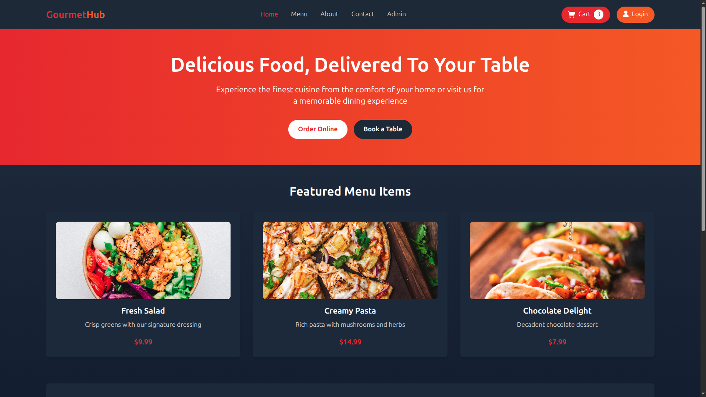

# 🍽️ GourmetHub - Delicious Food, Delivered To Your Table

GourmetHub is a modern and responsive restaurant web application built with **HTML**, **CSS (Tailwind CSS)**, and **JavaScript**.  
It allows users to explore menu items, order online, or book a table conveniently.  

---

## 🚀 Features

✅ Fully responsive and mobile-friendly design  
✅ Beautiful hero section with gradient background  
✅ Featured menu items with images, descriptions, and prices  
✅ Navigation bar with active links and icons  
✅ Smooth hover and transition animations  
✅ Modern dark theme UI  

---

## 🧩 Tech Stack

- **HTML5**
- **Tailwind CSS**
- **JavaScript**
- **Font Awesome Icons**
- **Django**
- **DRF**

---

