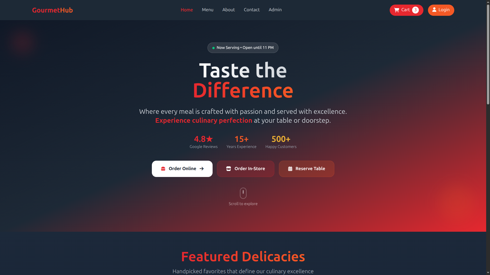

# 🍽️ GourmetHub - Restaurant Management System (Online + Offline Orders)

**GourmetHub** is a comprehensive restaurant management system designed to streamline operations for modern restaurants. It offers both **Online** Food Ordering and **Offline** POS (Point of Sale) Ordering functionalities within a single integrated platform, empowering restaurants to efficiently manage dine-in, takeaway, and delivery services with ease.

---

## 🚀 Key Highlights

- 🛍️ Online Ordering System (Customers)
- 🧾 Offline POS System (Admin/Staff)
- 🧑‍🍳 Role-based dashboards: Admin, Customer, Chef, Waiter, Delivery
- 📅 Table booking & reservation management
- 💳 Payment integration (Online + Cash)
- 📊 Real-time order tracking & analytics

---

## 🧱 Core Features

### 🔐 Authentication & Roles
- Custom Django user model with roles:
  - **Admin**
  - **Customer**
  - **Chef**
  - **Waiter**
  - **Delivery Person**
- Role-based access control & dashboards
- User registration, login, logout, password reset
- Social login via Google (optional)

---

## 🏠 Public Website
- Homepage with hero section & CTAs: *Order Online* and *Book a Table*  
- Featured menu items (dynamic from DB)
- About Us, Contact Us, and Menu pages
- Tailwind CSS responsive UI
- Dynamic navbar with cart and login/logout

---

## 🍔 Menu Management
- Add, edit, or delete menu items (Admin only)
- Categorize menu by type: **Starters, Main Course, Desserts, Drinks**
- Add food images, ingredients, and price
- Filter and search menu items
- Mark menu items as **Available**, **Featured**, or **Out of Stock**

---

## 🛒 Online Ordering System
- Customers can:
  - Add items to cart  
  - Modify quantities or remove items  
  - Checkout with delivery details  
  - Choose **Payment Method**:
    - 💳 Online Payment (Stripe / SSLCommerz)
    - 💵 Cash on Delivery
- Automatic email confirmation
- Order tracking with live status updates

---

## 🧾 Offline Order (POS System)
**For restaurant staff / waiters (Admin panel accessible):**

- Add walk-in (offline) customer orders
- Select table, menu items, and quantity
- Apply discounts and taxes
- Print receipts (POS thermal or PDF)
- Update order status: *Preparing → Served → Completed*
- Manage dine-in and takeaway orders from dashboard

---

## 🍽️ Table Reservation System
- Customers can book tables (date, time, guests)
- Staff can approve or reject bookings
- Automatically block unavailable tables
- Email/SMS confirmation
- Table status tracking (Available / Reserved / Occupied)

---

## 👩‍🍳 Staff & Kitchen Management
- **Chef dashboard:** View active orders and mark them as prepared
- **Waiter dashboard:** View dine-in table orders and manage serving
- **Delivery dashboard:** View delivery orders and update delivery status

---

## 💳 Payment System
- Multiple payment options:
  - Stripe / SSLCommerz / PayPal
  - Cash on Delivery (COD)
  - Offline POS payments
- Payment transaction logs stored in DB
- Downloadable or printable invoices

---

## ⭐ Customer Experience
- Order history and order tracking
- Rate and review dishes
- Save favorite menu items
- Edit profile and manage addresses
- Newsletter subscription

---

## 📊 Admin Dashboard
- Real-time stats:
  - Total Orders (Online / Offline)
  - Revenue, Top Selling Items
  - Daily, Weekly, Monthly sales
- Filter orders by type (Online / Offline / Takeaway)
- Graphs & charts using **Chart.js / Plotly**
- Export reports (CSV, Excel, or PDF)
- Manage users, menu, orders, and reservations

---

## 🌍 Advanced Features
- REST API via **Django REST Framework**
- Swagger / ReDoc API documentation
- Live order tracking via **Django Channels (WebSockets)**
- Dockerized deployment setup
- Multi-restaurant support (like Foodpanda)
- Push notifications for order updates
- QR Code digital menu for dine-in

---

## 🔮 Future Add-ons
- Loyalty & rewards system for frequent customers
- Ingredient inventory management
- Restaurant staff scheduling
- Smart order recommendations (AI-based)

---

## 🧩 Tech Stack

| Layer | Tools |
|-------|--------|
| **Backend** | Django , Django REST Framework |
| **Frontend** | Tailwind CSS, javaScript |
| **Database** | PostgreSQL |
| **Payment** | Stripe / SSLCommerz |
| **Deployment** | DigitalOcean + Gunicorn + Nginx |
| **Authentication** | Custom User Model / Django Allauth |

---

## 🧑‍💻 Author

- 💼 Building software solutions with Django & REST Framework
- 📧 Contact: [tasnimulhasan404@proton.me]

## 🪪 License

- This project is licensed under the **MIT** License.
- Feel free to use, modify, and enhance for personal or commercial use.

